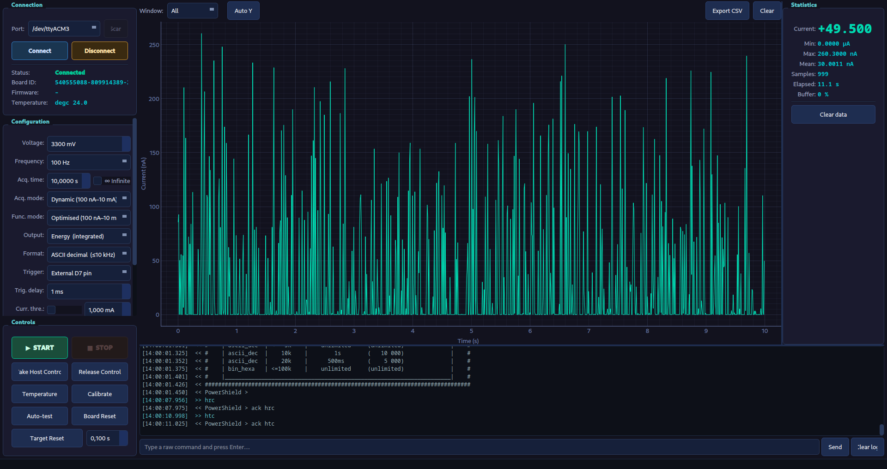

# X-NUCLEO-LPM01A Power Monitor GUI

> A desktop GUI for real-time current and energy measurement with the
> [ST X-NUCLEO-LPM01A](https://www.st.com/en/evaluation-tools/x-nucleo-lpm01a.html)
> PowerShield expansion board.



[](https://www.python.org/)
[](https://pypi.org/project/PyQt5/)
[](https://www.pyqtgraph.org/)
[](https://numpy.org/)
[](https://pyserial.readthedocs.io/)
[](LICENSE)
[](main.py)

---

## Overview

The X-NUCLEO-LPM01A PowerShield is an STM32 Nucleo expansion board that
measures current drawn by a target device with nanoamp resolution, across a
sampling range of 1 Hz to 100 kHz. This application replaces the official
Windows-only tool with a cross-platform GUI written entirely in Python.

**Key capabilities**

- Real-time waveform plot (up to 5 million samples in a rolling buffer)
- Live statistics: instantaneous current, min / max / mean, sample count, elapsed time
- Both data formats: ASCII decimal (≤ 20 kHz) and binary hexadecimal (≤ 100 kHz)
- Full measurement configuration: voltage, frequency, acquisition time, mode, trigger, power
- Device utilities: self-calibration, board auto-test, temperature readout, target power-cycle
- CSV export of the current buffer
- Serial console with raw command input

---

## How It Works

### Architecture

```
main.py
  └─ MainWindow (ui/main_window.py)
       ├─ ConnectionPanel  – port selection, device info
       ├─ ConfigPanel      – measurement parameters
       ├─ ControlPanel     – start / stop, host control, utilities
       ├─ PlotWidget       – pyqtgraph real-time waveform
       ├─ StatsPanel       – live statistics sidebar
       └─ ConsoleWidget    – raw serial log + command input

core/
  ├─ protocol.py      – command builders (ASCII strings → bytes)
  ├─ serial_worker.py – QThread: serial I/O state machine
  └─ data_parser.py   – AsciiParser / BinaryParser for measurement streams
```

### Communication

The board communicates over a virtual COM port (USB-CDC) at **3 686 400 baud**.
On Linux the non-standard baud rate is applied via a `termios2` / `ioctl`
call because the standard POSIX baud-rate enum does not include it.

A dedicated `QThread` (`SerialWorker`) handles all I/O so the GUI stays
responsive. It runs a three-state machine:

| State | Description |
|---|---|
| `idle` | No serial port open |
| `ready` | Connected; sends commands and waits for `ack`/`error` responses |
| `acquiring` | Streaming measurement data; routes bytes to the active parser |

### Data Formats

**ASCII decimal** — each sample is a 7-character token `DDDDSee` where
`DDDD` is a 4-digit mantissa, `S` is the sign of the exponent, and `ee` is
the two-digit exponent. Example: `6409-07` → 6409 × 10⁻⁷ = 640.9 µA.

**Binary hexadecimal** — each sample is 2 bytes. The upper nibble of byte 1
encodes the negative base-16 exponent; the remaining 12 bits are the integer
value. Metadata packets (timestamps, errors, end-of-acquisition markers,
overcurrent events) are embedded in the stream prefixed with `0xF0`.

---

## Requirements

- Python 3.9 or newer
- A [ST X-NUCLEO-LPM01A](https://www.st.com/en/evaluation-tools/x-nucleo-lpm01a.html) board connected via USB

Install Python dependencies:

```bash
pip install -r requirements.txt
```

| Package | Purpose |
|---|---|
| [PyQt5](https://pypi.org/project/PyQt5/) | GUI framework |
| [pyqtgraph](https://www.pyqtgraph.org/) | Real-time plotting |
| [NumPy](https://numpy.org/) | Array operations for plot decimation and scaling |
| [pyserial](https://pyserial.readthedocs.io/) | Serial port access |

> **Linux note:** The application sets the non-standard 3 686 400 baud rate
> via `termios2`. No extra packages are required; this uses the standard
> `fcntl` and `struct` modules.

---

## Usage

```bash
python main.py
```

### Step-by-step

1. **Connect** — plug the PowerShield into a USB port, select the serial port
   from the dropdown (click **Scan** to refresh the list), then click
   **Connect**. The application automatically probes the device (`powershield`,
   `version`) and switches it to host-controlled mode (`htc`). The board ID
   and firmware version are shown in the Connection panel.

2. **Configure** — adjust measurement parameters in the Configuration panel:

   | Parameter | Description |
   |---|---|
   | Voltage | Target supply voltage (1800–3300 mV) |
   | Frequency | Sampling rate (1 Hz – 100 kHz) |
   | Acq. time | Measurement duration; tick **∞ Infinite** for continuous acquisition |
   | Acq. mode | Dynamic (100 nA–10 mA, varying current) or Static (2 nA–200 mA, constant) |
   | Func. mode | Optimised (best range) or High-current (30 µA–10 mA, faster) |
   | Output | Current (instantaneous A) or Energy (integrated J per sample period) |
   | Format | ASCII decimal (≤ 20 kHz) or Binary hex (≤ 100 kHz) |
   | Trigger | Software (immediate) or External D7 pin |
   | Trig. delay | Delay from trigger to measurement start (0–30 000 ms) |
   | Curr. thre. | Optional current threshold for D2/D3 signal and LED4 (enable checkbox first; not supported by all firmware versions) |
   | Power | Auto / Force ON / Force OFF |
   | Power end | Target power state after acquisition ends |

   Click **Apply configuration** to push settings without starting a
   measurement, or use **START** to push settings and begin immediately.

3. **Acquire** — click **▶ START**. All configuration values are sent to the
   board followed by the `start` command. The waveform plot and statistics
   panel update in real time. Click **■ STOP** to end the acquisition.

4. **Analyse** — use the **Window** selector in the plot toolbar to zoom into
   the most recent N samples. Toggle **Auto Y** to lock or unlock vertical
   auto-scaling. Click **Export CSV** to save the full buffer to a file.

5. **Utilities** (Controls panel):

   | Button | Command | Description |
   |---|---|---|
   | Take Host Control | `htc` | Switch board from standalone to host mode |
   | Release Control | `hrc` | Return board to standalone mode |
   | Temperature | `temp` | Read board temperature (°C) |
   | Calibrate | `calib` | Run self-calibration (recommended after >5 °C temperature shift) |
   | Auto-test | `autotest` | Run board self-diagnostics |
   | Board Reset | `psrst` | Hardware reset of the PowerShield |
   | Target Reset | `targrst` | Power-cycle the target for a configurable duration; can be used during acquisition to observe the power-up transient |

6. **Console** — the bottom drawer shows every sent (`>>`) and received (`<<`)
   serial line. Type raw commands into the input field and press **Send** or
   Enter to send them directly to the device.

---

## Project Structure

```
x-nucleo-lpm01a-gui/
├── main.py               # Entry point
├── requirements.txt      # Python dependencies
├── assets/
│   └── app.png           # Application screenshot
├── core/
│   ├── protocol.py       # Command builders
│   ├── serial_worker.py  # Async serial I/O (QThread)
│   └── data_parser.py    # ASCII and binary stream parsers
└── ui/
    ├── main_window.py    # Top-level window and signal wiring
    ├── connection_panel.py
    ├── config_panel.py
    ├── control_panel.py
    ├── plot_widget.py
    ├── stats_panel.py
    ├── console_widget.py
    └── styles.py         # Dark theme stylesheet
```

---

## License

This project is licensed under the **GNU General Public License v3.0**.
See [LICENSE](LICENSE) for the full text.
